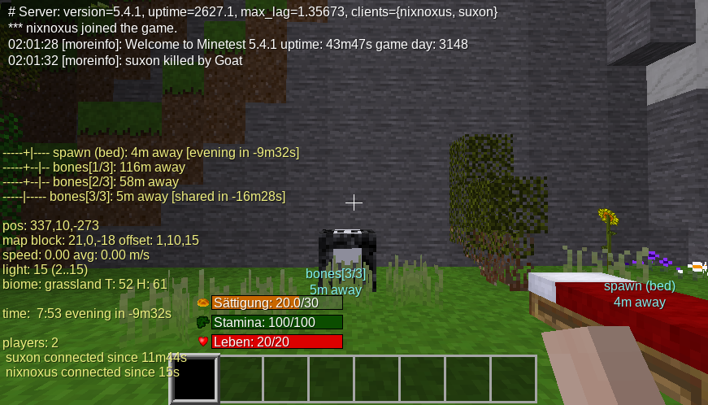

# MoreInfo

[](https://content.minetest.net/packages/nixnoxus/moreinfo/)
[](https://content.minetest.net/packages/nixnoxus/moreinfo/)
[](https://github.com/nixnoxus/moreinfo/actions/workflows/luacheck.yml)


MoreInfo mod for [Minetest](http://minetest.net/) 5.4.1 or newer



## Features

- make deaths public via chat message
- shows the direction and distance to
  - spawn point (position of the last used bed)
  - the last 3 bones
- shows infomation about the current player position
  - position
  - map block and offset in the map block
  - current and average speed
  - light level (min..max)
  - biome name, heat (T) and humidity (H)
- shows game infomation
  - game time and a countdown to the next morning or evening
  - player names and their connection time

All features are enabled by default.
- The server admin can change the defaults in `minetest.conf`. For example:
```ini
# server settings
moreinfo.public_death_messages = true
moreinfo.bones_limit = 3

# default settings. the player can change his own settings with chat commands
moreinfo.enable_long_text = false

moreinfo.display_waypoint_info = false
moreinfo.display_position_info = false
moreinfo.display_game_info = false
moreinfo.display_players_info = false

moreinfo.waypoint_bed = false
moreinfo.waypoint_bones = false
```

- The player can change his own settings with chat commands. The format is as follows:
```
/moreinfo { + | - }{ any | waypoint | position | game | players | bed | bones | long_text }
```
- Examples
```
/moreinfo -any

/moreinfo +bed
/moreinfo +bones

/moreinfo +waypoint
/moreinfo +position
/moreinfo +game
/moreinfo +players

/moreinfo +long_text
```

## Supported mods

 * `default`, `beds`, `bones` (contained in [Minetest Game](https://github.com/minetest/minetest_game/))
 * `mobs` [mobs_redo](https://notabug.org/TenPlus1/mobs_redo)

# Licencse

Copyright (C) 2021 nixnoxus

Licensed under the GNU LGPL version 2.1 or later.

See [LICENSE.txt](LICENSE.txt) and http://www.gnu.org/licenses/lgpl-2.1.txt

